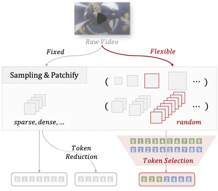

# Make Your Training Flexible: Towards Deployment-Efficient Video Models

This repo is the official implementation of "Make Your Training Flexible: Towards Deployment-Efficient Video Models". By Chenting Wang, Kunchang Li, Tianxiang Jiang, XiangyuZeng, Yi Wang, and Limin Wang.

<!-- ## Update

- **2025/03/18**: We build the repo and release the paper. -->

## Introduction

Popular video training methods mainly operate on a fixed number of tokens sampled from a predetermined spatiotemporal grid, resulting in sub-optimal accuracy-computation trade-offs due to inherent video redundancy. They also lack adaptability to varying computational budgets for downstream tasks, hindering applications of the most competitive model in real-world scenes. We thus propose a new test setting, Token Optimization, for maximized input information across budgets, which optimizes the size-limited set of input tokens through token selection from more suitably sampled videos. To this end, we propose a novel augmentation tool termed Flux. By making the sampling grid flexible and leveraging token selection, it is easily adopted in most popular video training frameworks, boosting model robustness with nearly no additional cost. We integrate Flux in large-scale video pre-training, and the resulting FluxViT establishes new state-of-the-art results across extensive tasks at standard costs. Notably, with 1/4 tokens only, it can still match the performance of previous state-of-the-art models with Token Optimization, yielding nearly 90\% savings.

## Performance

#### Single Modality Action Recognition

#### Multi Modality Video-Text Retrieval

#### Multi Modality VideoChat Model

Coming Soon

## Acknowledgement

This repository is built based on [UniFormer](https://github.com/Sense-X/UniFormer), [VideoMAE](https://github.com/MCG-NJU/VideoMAE), [VINDLU](https://github.com/klauscc/VindLU) and [Unmasked Teacher](https://github.com/OpenGVLab/unmasked_teacher/) repository. 
